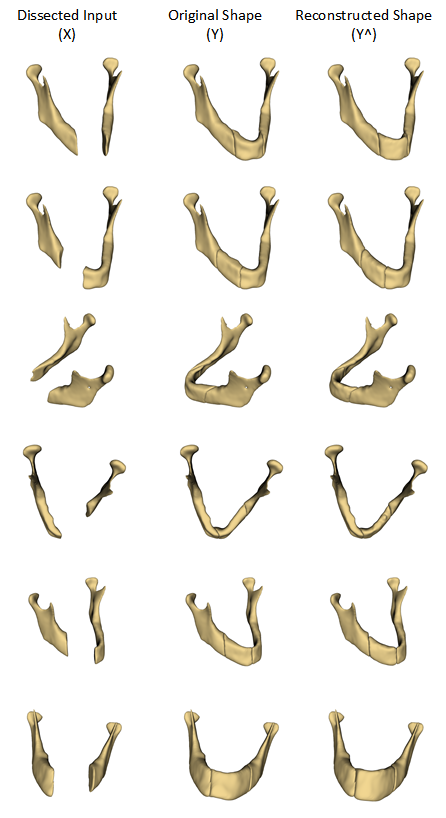

## Probabilistic Shape Completion with Multi-target Conditional Variational Autoencoders

This repository accompanies the article expected to be published in 
the 22nd International Conference on Medical Image Computing and Computer Assisted Intervention (MICCAI 2019), 
which will be held from October 13th to 17th, 2019, in Shenzhen, China.

Please consider citing our  MICCAI 2019 paper if you enjoyed the implementation. The draft can be accessed [here](https://arxiv.org/pdf/1906.11957.pdf).

    @InProceedings{10.1007/978-3-030-32254-0_26,
        author="Abdi, Amir H.
        and Pesteie, Mehran
        and Prisman, Eitan
        and Abolmaesumi, Purang
        and Fels, Sidney",
        title="Variational Shape Completion for Virtual Planning of Jaw Reconstructive Surgery",
        booktitle="Medical Image Computing and Computer Assisted Intervention -- MICCAI 2019",
        year="2019",
        publisher="Springer International Publishing",
        address="Cham",
        pages="227--235",
    }

### Download data
To download the data and set the environment variable $DATASETS to where the data is 
downloaded, run

    source download-data.sh 

### Train and Test Model
This is a Python3 implementation. To train the conditional VAE model for shape completion with the default data 
(mandible dataset), install the requirements by running

    pip install -r requirements.txt

And run the training script
    
    bash scripts/train-CVAE-vwDice-TWcvae
    

To test the model, set the `--test=true` and set the 
`--load_model_path` flag to where the trained model is stored. 

### Sample Results

